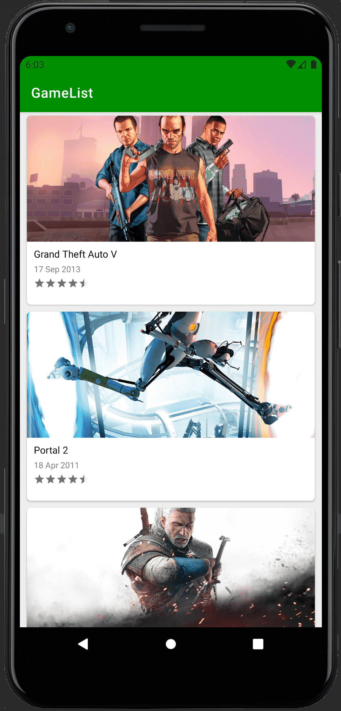
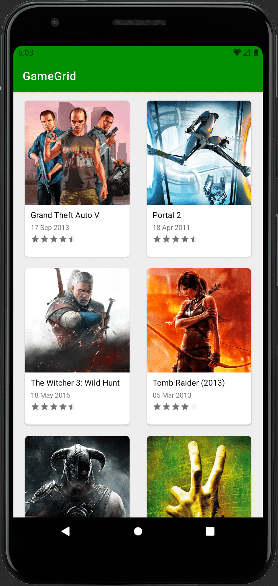

# MobisemDemo

Bu projede Android MVVM Design Pattern'ini kullandım. RxJava ve Android Architecture Component'leri isteklerin UI'ı kitlemesini engellemeyi sağladım.

İstenilen apk dosyaları ->  mobisemDemo/app/GameGrid/release/app-GameGrid-release.apk ,  mobisemDemo/app/GameList/release/app-GameList-release.apk

Kullandığım kütüphaneler aşağıdaki gibidir;

*     buildFeatures { viewBinding = true } ------------------------- Uygulamada viewlara erişmek için android'in View Binding methodunu kullandım.
*     "androidx.cardview:cardview:1.0.0" --------------------------- Tasarımda gölgelendirmeler için kullandım.
*     "io.reactivex.rxjava2:rxjava:2.2.8"  ------------------------- Arka plan işlemleri için kullandım.
*     "io.reactivex.rxjava2:rxjava:2.2.8"  ------------------------- Arka plan işlemleri için kullandım.
*     "com.squareup.retrofit2:retrofit:$retrofitVersion" ----------- API'dan veri çekmek için kullandım.
*     "com.squareup.retrofit2:adapter-rxjava2:$retrofitVersion" ---- API'dan gelen veriyi Observable olarak kullanabilmek için kullandım.
*     "com.squareup.retrofit2:converter-gson:2.4.0"----------------- Retrofit'teki veriyi gson tipine çevirmek için kullandım.

Product Flavor hakkında;

Gradle'da 2 farklı Product Flavor oluşturdum('GameGList','GameGrid').

Adapter, Model, ViewModel, Service ortak kullanıldığı için main modülüne, Grid görünüm için GridSpacingItemDecoration, Measure classlarını GameGrid modülüne ekledim.GameGrid ve GameList modülleri içerisindeki MainActivity.class ile istenilen farklı görünümü elde ettim.

Uygulamanın ekran görüntüleri aşağıdaki gibidir.
 

